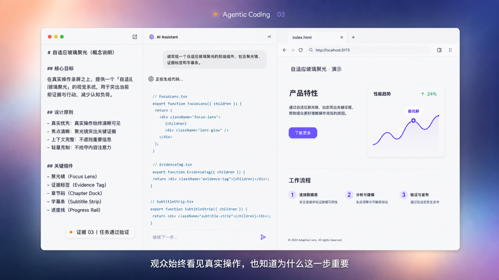
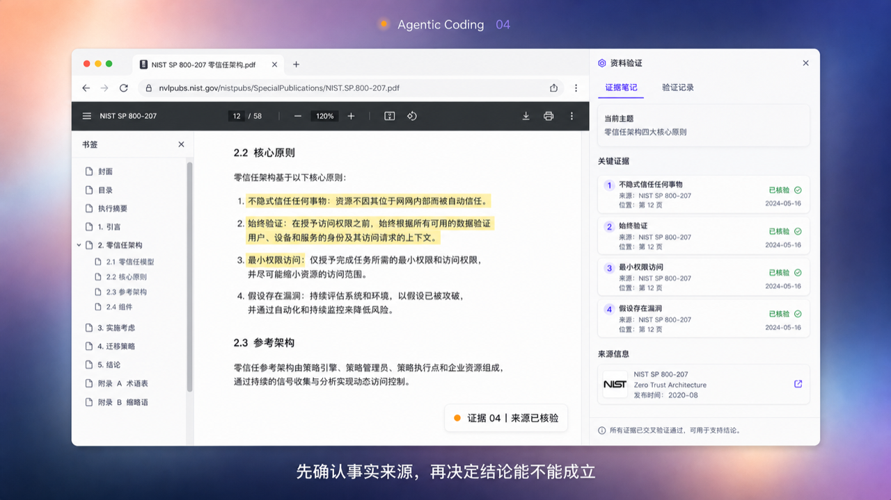
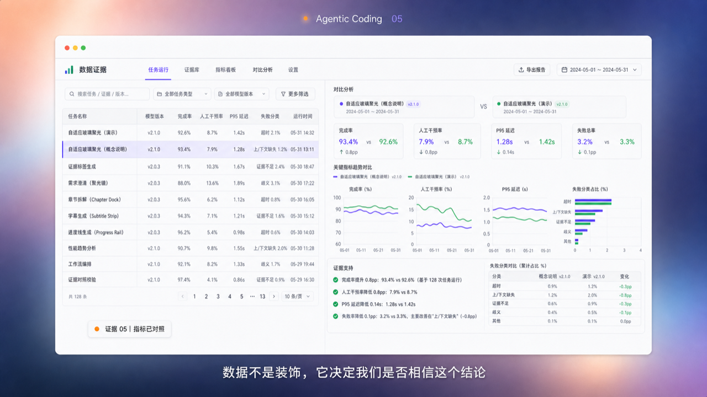
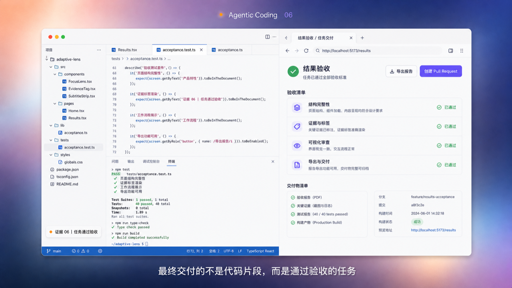
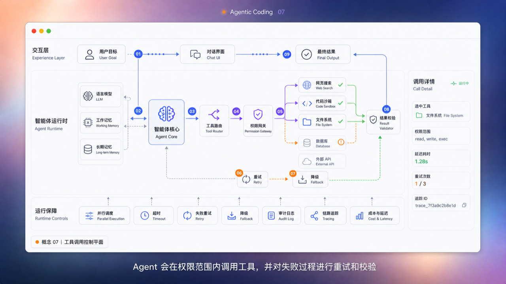

# AI 知识长视频视觉系统 v3.0

> 状态：**Approved design target / 已确认设计目标**
>
> 方向：**浅色模糊桌面 + 大内容窗口 + 真实证据 + 浅色技术图解**
>
> 生效日期：2026-08-04
>
> 适用范围：8～12 分钟中文 AI 知识视频；16:9 母版，支持 9:16 重构输出
>
> 实施状态：Remotion 30 秒横屏/竖屏样片已实现；完整 8～12 分钟模板待迁移
>
> 参数真源：[`studio/config/visual-system.json`](../studio/config/visual-system.json)

## 0. 决策摘要

这套系统把模糊渐变背景当作一张稳定的“电脑壁纸”，把所有需要讲解的内容放进桌面窗口。真实产品、官方资料、数据、代码、结果验收和概念架构图可以更换，但壁纸、窗口比例、字幕位置和动效语法保持稳定。

最终画面不是仓库控制台录屏，也不是连续的文字幻灯片。它是一套可复用的 AI 知识视频语言：

1. 真实内容负责证明；
2. 程序化图解负责解释；
3. 窗口与壁纸负责统一不同素材；
4. 动效只负责指示关系、焦点和状态变化；
5. 字幕负责跟随口播，不承担装饰。

已确认的硬约束：

- 不显示播放器进度条、播放头、已播时长、总时长或章节计数；允许底部语义章节进度，但标签只能显示“序号 + 段落名”，不得显示秒数；
- 不使用巨型液态玻璃圆圈、放大镜、聚光环或持续光晕；
- 字幕不放进液态玻璃容器；
- 液态玻璃只允许在极少数有功能的控件上出现，默认关闭；
- 窗口应大，背景只保留足够形成空间感的边缘；
- 新页面使用 macOS 窗口缩小/恢复式转场，但不让两个完整窗口叠在一起；
- AI 概念必须能切换为帮助理解的图解，不能只靠文字描述；
- 技术图解采用苹果浅灰底、冷白面板，中文主标签、英文技术副标签；
- 图解结构以清楚的调用闭环和分层控制平面为主，不采用密集横向时序图作为默认形式。

## 1. 视觉北极星

### 1.1 关键词

**清楚、可信、克制、现代、窗口化、可验证、可解释。**

### 1.2 观众应获得的感受

- 像在观看一位专业讲解者操作和拆解真实 AI 产品；
- 复杂概念被组织成看得懂的系统，而不是“科技感装饰”；
- 即使页面类型变化，仍然像同一条视频；
- 画面足够精美，但所有视觉元素都有叙事作用。

### 1.3 视觉优先级

1. 当前口播需要观众看懂的关键对象；
2. 与结论直接相关的真实证据；
3. 帮助理解关系的程序化图解；
4. 来源、状态和风险说明；
5. 品牌氛围与装饰。

任何装饰都不能挤占前四项。

## 2. 输出策略与安全区

### 2.1 母版

| 项目 | 标准 |
|---|---|
| 分辨率 | `1920 × 1080` |
| 比例 | `16:9` |
| 帧率 | `30fps` |
| 色彩 | sRGB / Rec.709 |
| 主窗口 | X `94～1826`，Y `98～948` |
| 字幕区 | Y `872～940` |

### 2.2 竖屏派生版

9:16 不是把完整横屏机械缩小，也不是中央裁切。相同场景数据进入独立的竖屏布局：真实录屏改为纵向主卡片，概念架构重排为上下因果链，验收页改为终端、证据画面、清单的垂直堆叠。

适配规则：

- 核心结论、当前节点和当前证据必须能进入中央裁切区；
- 复杂架构图在竖屏中拆成“总览 → 局部路径 → 结果”三段，不要求一次显示全图；
- 横向录屏通过镜头跟随、局部放大和焦点重排适配；
- 字幕保持居中，不随内容窗口横向移动；
- 竖屏平台按钮遮挡区由导出模板单独处理，不把平台控件画进母版。

### 2.3 单屏信息上限

- 一屏只讲一个判断或一个动作；
- 当前高亮对象不超过 3 个；
- 普通节点不超过 12 个；超过时按层或按步骤拆镜头；
- 观众应在 3 秒内看出“现在讲哪里”。

## 3. 固定舞台结构

从后到前依次为：

1. `WallpaperStage`：模糊渐变壁纸；
2. `ChapterLabel`：顶部章节或主题标签；
3. `ContentWindow`：承载所有主要内容；
4. `EvidenceTag`：窗口内的证据/概念标签；
5. `PlainSubtitle`：窗口下缘的普通字幕；竖屏版可放在窗口外的壁纸留白区；
6. `VisualSystemV1ChapterProgress`：视频最底部的语义章节进度，分段宽度按各段真实时长计算，段间保留断点，标签不显示任何时长。

固定结构不得增加视频播放器进度、页码、章节总数或任何秒数。语义章节进度只表达当前段落与全片结构，不承担播放器时间码功能。窗口内容变化时，舞台坐标保持稳定。

### 3.1 同级卡片自适应铺满

同一页面内的卡片如果属于独立、同级的小模块，并且能在安全区内保持可读，应优先铺满标题与字幕之间的可用视窗，不能缩成一排小卡片悬在画面中央：

- 横版卡片最大安全包络为 `x=90～1830`、`y=342～837`；实际上下边界必须根据当前标题与字幕向内收缩，并落在整数像素；
- 1～5 张使用单行，6～12 张使用两行；超过 12 张必须拆页，不得继续压缩字体或间距；
- 同页同层级卡片必须等宽、等高、上下边对齐；每一行整体居中，最后一行不能靠左悬空；
- 卡片宽高、行列和间距由 `visualSystemV1AdaptiveCardLayout` 统一计算，不允许在场景里逐张硬编码；
- 每个场景必须把实际标题区底部、字幕区顶部和内容所需最小卡片宽高交给布局函数；函数会保留至少 `24px` 间隔，不满足时直接要求拆页，不能只凭外框尺寸判断“放得下”；
- 卡片内容簇保持左对齐并在卡片内光学垂直居中；禁止只拉高外框、文字仍堆在顶部形成空壳；
- 卡片字号必须由同页最终卡片宽高统一计算，不能按单张文案长度分别缩放；当前单行五卡片统一使用 `marker 16px / 标题 42px / 说明 24px`，双卡放大为约 `17px / 50px / 26px`，单卡放大为 `18px / 56px / 28px`，双行紧凑卡片约使用 `13～14px / 30～32px / 18～19px`；
- 卡片标题与说明最多各两行；不满足时应缩短文案或拆页，不能用省略号隐藏信息，也不能继续把单张卡片缩成更小字号；卡片最低高度为 `219px`；
- 单行流程的连线端点必须跟随卡片边缘中点逐帧重新计算；新增节点入场前，已有卡片先用 `8` 帧完成无超调重排，新节点随后使用既有 `18` 帧 spring 入场；禁止 CSS `transition` 或 `animation`；
- 单一大内容仍使用开放画布，不能为了“铺满”再套一张大卡片；本规则只适用于真正独立的小模块。

当前五卡片基准为：每张 `308×494px`、横向间隔 `50px`，卡片位于 `y=343～837`，首尾贴合 `x=90～1830`；内部文字组约高 `131px`，相较旧版固定小字号增加约 40%。

### 3.2 场景自适应构图

流程类页面不得从第一帧就预留最终五卡槽位。构图必须跟随当前已经出现的信息量变化，并始终保持卡组横向居中：

| 当前节点数 | 卡片尺寸 | 横向位置 | 文字层级（标记/标题/说明） |
|---:|---:|---|---:|
| 1 | `920×494px` | `500` | `18 / 56 / 28px` |
| 2 | `760×494px` | `172、988` | `17 / 50 / 26px` |
| 3 | `542.67×494px` | `90、688.67、1287.33` | `16 / 42 / 24px` |
| 4 | `393×494px` | `90、539、988、1437` | `16 / 42 / 24px` |
| 5 | `308×494px` | `90、448、806、1164、1522` | `16 / 42 / 24px` |

- 单卡和双卡不靠左占用最终卡槽；三卡以上铺满横版安全区；
- 重排期间所有当前可见同级卡片仍保持相同宽高、字号和表面类型，不允许一张先变小、另一张后变小；
- 新节点出现前，未来卡片和对应连线都保持不可见；新连线必须与目标卡片同帧启动，只从上一节点边缘向未来位置平滑生长，不得提前形成悬空短线、穿过卡片或反向绘制；
- 当前讲解节点只能通过同主题色的轻底色、细边框和 marker 色获得焦点；不改变卡片尺寸、字号或立体程度；人工确认可使用占比不超过 20% 的紫色焦点；
- 场景标题切换不能重置工作流几何；内部切点使用 `8` 帧顺序交接，前 `4` 帧只淡出旧标题、后 `4` 帧只淡入新标题，任一帧不得叠字；背景柔光、字幕、章节进度和右上角 AI 水印继续使用各自的全局时间线。

## 4. 渐变壁纸

壁纸是整条视频的视觉锚点，不是每个章节重新生成的背景。

### 4.1 色彩分布

- 左上：珊瑚桃色柔光；
- 顶部中央：薰衣草紫；
- 两侧与底部：珍珠蓝、雾白和淡薰衣草；
- 底部中间：少量暖粉色回光；
- 右下：极少量紫色过渡。

### 4.2 推荐色值

| 角色 | 色值 |
|---|---|
| 雾白基底 | `#EEF3FA` |
| 珍珠蓝 | `#B7D3F5` |
| 薰衣草紫 | `#CDD6F6` |
| 珊瑚桃 | `#F5C9BD` |
| 暖粉回光 | `#F1C6CE` |
| 淡紫过渡 | `#D8D0F5` |

### 4.3 动态规则

- 壁纸只允许极慢漂移：20 秒内位移不超过画布宽度的 1.5%；
- 亮度变化不超过 6%；
- 不跟随每个点击呼吸或闪烁；
- 不增加粒子、星点、扫描线或科技网格；
- 转场时壁纸保持原位，建立“桌面仍在、窗口更换”的连续性。

## 5. 内容窗口

### 5.1 几何参数

| 属性 | 标准 |
|---|---|
| X / Y | `94 / 98` |
| 宽 / 高 | `1732 / 880` |
| 圆角 | `24px` |
| 顶栏高度 | `56px` |
| 内边距 | `24～32px` |
| 描边 | `1px rgba(108,123,147,0.22)` |
| 阴影 | `0 24px 72px rgba(52,72,105,0.18)` |

窗口约占母版宽度 90%，背景只露出足以形成桌面空间感的边缘。窗口不需要模拟完整操作系统，只保留三个小圆点或简洁标题栏即可。

### 5.2 层级规则

- 视频舞台只出现一个主窗口；
- 如果真实录屏已带浏览器框架，应裁掉多余桌面边缘，避免“窗口套窗口”；
- 右侧详情栏只在确有参数、来源或验证信息时出现；
- 面板分隔优先使用留白、浅灰层级和细线，不把每个对象都做成卡片；
- 普通页面不使用大面积毛玻璃。

### 5.3 窗口状态

- `settled`：稳定讲解状态，默认；
- `focus`：局部放大一个关键区域；
- `compare`：左右对照，推荐 `56/44`；
- `inspect`：主内容 + 右侧窄详情栏；
- `minimizing` / `restoring`：只用于页面切换转场。

## 6. 色彩系统

### 6.1 内容窗口浅色主题

| 角色 | 色值 | 用途 |
|---|---|---|
| 窗口底 | `#F2F2F4` | 主画布 |
| 主面板 | `#FAFAFB` | 节点、录屏边框、基础面板 |
| 提升面板 | `#FFFFFF` | 详情、验收与高层级区域 |
| 主文字 | `#16213A` | 中文标题、核心判断 |
| 次文字 | `#667085` | 英文副标签、说明 |
| 细分隔线 | `#DCE2EA` | 分组与连接 |
| 活跃蓝 | `#2F7FF7` | 当前路径与当前动作 |
| 结构紫 | `#6E78D8` | Agent、模型、路由关系 |
| 返回青 | `#3F9EC6` | 结果回流 |
| 通过绿 | `#2CA66F` | 已验证成功 |
| 警示橙 | `#E58945` | 当前证据、重试、降级 |
| 错误红 | `#D95865` | 真实失败与阻断 |

### 6.2 使用规则

- 一屏最多 2 个主强调色，状态色可额外出现；
- 蓝/紫表示系统路径，不表示“更高级”；
- 绿色只用于有证据的成功；
- 橙色用于当前关注、重试或需要解释的异常；
- 红色只用于真实错误和阻断；
- 外部产品原始 UI 不强行重染，外部标注遵循本系统色彩。

## 7. 字体与文字层级

推荐：

- 中文：`HarmonyOS Sans SC`、`PingFang SC` 或 `Noto Sans SC`；
- 英文与数字：`Inter`；
- 代码：`JetBrains Mono`。

| 用途 | 字号 | 字重 |
|---|---:|---:|
| 顶部章节标签 | 24～28px | 500～600 |
| 窗口内页面标题 | 30～38px | 700 |
| 核心判断 | 42～54px | 700～800 |
| 图解中文节点 | 22～26px | 650～750 |
| 图解英文副标签 | 14～17px | 500 |
| 正文/表格 | 18～22px | 450～600 |
| 来源和状态 | 15～18px | 500～650 |
| 普通字幕 | 42～48px | 650～750 |

中文是主叙事语言。技术图解采用“中文主标签 + 英文副标签”，例如：

`工具路由`<br>
`Tool Router`

不要用英文堆叠制造专业感。所有最终文字必须由 Remotion/HTML 渲染，不能直接依赖生成图片中的文字。

## 8. 字幕与标签

### 8.1 普通字幕

- 横屏位于窗口下缘、画面中央；竖屏可放在窗口外的壁纸留白区；
- 深色文字，使用极轻的柔和阴影；
- 无背景盒、无描边、无液态玻璃；
- 最多两行，每行建议 16～22 个汉字；
- 语义分句，不机械逐字弹跳；
- 比语音提前 2 帧进入，句尾保留 6～10 帧；
- 当前画面已有大结论文字时隐藏普通字幕。

### 8.2 章节标签

格式：`主题名`，例如 `Agentic Coding`。

- 默认为顶部居中的轻量玻璃章节胶囊 + 两个小蓝点；
- 不显示章节序号或“第 7 / 8 章”；
- 章节标签是唯一默认允许的轻量玻璃组件，不扩散到字幕或内容卡片。

### 8.3 证据/概念标签

格式示例：

- `证据 04｜来源已核验`
- `证据 05｜指标已对照`
- `概念 07｜工具调用控制平面`

标签是扁平冷白底、细边框、小蓝点。它只说明画面性质，不承担主标题职责。

## 9. 七类可复用内容页面

### A. 真实录屏页 `screenCapture`

适合产品演示、浏览器、编辑器、终端和真实任务操作。

- 保留真实鼠标、输入、等待、报错和结果；
- 一次只高亮一个操作目标；
- 使用轻微镜头跟随，不显示虚假操作；
- 真实账号、密钥、通知和隐私信息必须清理；
- 不用生成式 UI 冒充真实产品。

### B. 来源核验页 `sourceReview`

左侧为官方文档/PDF/论文，右侧为证据笔记或主张核验。

- 高亮内容必须与口播结论直接相关；
- 显示机构、标题、发布日期/版本和截取日期；
- 引文只显示必要短段；
- 画面底部或标签中明确“来源已核验”。

### C. 数据证据页 `dataEvidence`

表格、指标对照与图表用于回答“结论是否被数据支持”。

- 一屏只突出一个比较问题；
- 图表轴、单位、时间范围和样本量必须可读；
- 当前结论对应的数据使用活跃蓝或通过绿；
- 不做只有数字卡片、没有判断关系的仪表盘。

### D. 概念架构页 `conceptArchitecture`

用于 Agent 工具调用、RAG、记忆、权限、评测、编排等抽象机制。

- 苹果浅灰画布，使用冷白面板和克制描边保持结构清楚；
- 中文主标签、英文副标签；
- 默认采用“调用闭环 + 分层控制平面”；
- 当前路径清楚，非当前模块降为浅灰；
- 概念图必须标注“概念”或“示意”，不能当作真实运行证据。

### E. 代码与变更页 `codeReview`

左侧代码/Diff，右侧预览、测试或解释。

- 只显示与当前结论相关的代码；
- 字号不得因完整展示文件而缩小到不可读；
- 代码高亮、终端结果和产品预览形成因果链；
- 路径、命令和测试结果必须来自真实演示环境。

### F. 结果验收页 `acceptance`

左侧终端/测试，右侧验收清单或最终结果。

- 明确区分“测试通过”和“任务完成”；
- 展示通过项、未覆盖项、剩余风险和交付物；
- 绿色状态必须可追溯到真实测试或人工验收；
- 不使用庆祝粒子或巨大成功图标。

### G. 结论页 `statement`

窗口内只保留一个判断和 2～4 个支持点。

- 仍保留窗口和壁纸，不切换成无关海报风；
- 可以临时隐藏证据标签；
- 结论停留 1.2～1.8 秒后进入下一段。

## 10. Agent 工具调用概念图标准

概念图的默认信息结构：

```text
交互层 Experience Layer
用户目标 → 对话界面 → 最终结果

智能体运行时 Agent Runtime
模型 + 工作记忆 + 长期记忆
        ↓
智能体核心 → 工具路由 → 权限网关 → 并行工具 → 结果校验
    ↑                              ↓
    └──────── 结果回流 / 重试 / 降级 ────────┘

运行保障 Runtime Controls
并行调度 / 超时 / 重试 / 降级 / 审计日志 / 链路追踪 / 成本与延迟
```

### 10.1 视觉规则

- 节点使用深蓝面、1px 低对比细边框和 12～16px 圆角；
- 主节点可轻微提升，但不使用发光脑图标或大圆环；
- 主线 2.5px，次线 1.5px；
- 箭头必须表达方向；
- 当前步骤使用编号 `01～09`；
- 一条失败路径使用橙色虚线，一条恢复路径使用绿色；
- 返回路径使用青色或蓝色，不与前进路径混淆；
- 可选右侧 `Call Detail` 只显示工具、权限、延迟、重试次数和 Trace ID。

### 10.2 讲解动效

概念图不是一次全亮。推荐顺序：

1. 先出现用户目标和 Agent Core；
2. 模型与记忆淡入；
3. Tool Router 和 Permission Gateway 依次点亮；
4. 工具分支展开；
5. 当前调用路径沿线绘制；
6. 失败节点变橙，进入 Retry/Fallback；
7. 结果合并并进入 Validator；
8. 回流到 Agent Core 和 Final Output；
9. 最后补充 Runtime Controls。

节点进入使用 160～240ms，连线绘制 220～360ms，步骤错开 80～140ms。除当前状态点外，不做无限循环动画。

## 11. 真实证据边界

生成图只用于确定视觉方向，不能替代最终证据。

- 真实产品、官方文档、测试、日志、代码和结果必须使用真实素材；
- 概念架构图可以程序化生成，但必须标注“概念/示意”；
- 数据图表必须来自已登记数据或明确标注为演示数据；
- 来源画面首次出现时登记产品/机构、页面/版本、截取日期；
- 无法确认来源的画面不得用于证明事实；
- 生成图片中的文字不得直接成为成片文字真源。

推荐单期素材比例：

| 类型 | 建议占比 |
|---|---:|
| 真实录屏、文档、代码、日志、测试 | 55%～70% |
| 程序化概念图、数据图和对照页 | 20%～35% |
| 结论页与章节过渡 | 5%～10% |
| 纯氛围素材 | 0%～5% |

不再强制加入人物、手部或桌面实拍。只有当人物行为本身能解释目标设定、审批或验收时才使用。

## 12. 镜头与强调

- 普通镜头平均 3～6 秒；
- 每 15～25 秒切换一次内容模式；
- 同时运动对象不超过 3 个；
- 局部放大控制在 `1.04～1.16`；
- 高亮框 2px，进入 180～260ms；
- 鼠标附近不加巨型圆圈，使用小型指针、轻微缩放或局部描边；
- 需要保留上下文时，主画面缩到 88%～94%，右侧打开解释栏；
- 切换到新主题时才更换整个窗口，不为每个句子做窗口转场。

## 13. 窗口转场

### 13.1 单窗口两阶段接管

页面环境明显变化时，保留 Apple 窗口缩小/恢复的空间语法，但取消双窗口重叠：

1. 旧窗口在 18 帧内围绕中心等比缩小到 92%，最后快速淡出；
2. 桌面壁纸单独保留 3 帧，明确完成语义交接；
3. 新窗口从 96.5% 在 18 帧内恢复到 100%；
4. 任意一帧最多渲染一个内容窗口，不切换双窗口层级；
5. 不使用模糊滤镜、`scaleX`/`scaleY` 非等比挤压、弹跳、旋转或透视扭曲。

单次接管共 39 帧。进入曲线使用 `[0.22, 1, 0.36, 1]`，退出曲线使用 `[0.4, 0, 0.6, 1]`，以低弹跳、无跳帧的产品动效为目标。

### 13.2 Magic Move 式内容连续性

同一概念页内部不切整页。共享节点保持位置，通过连续的描边、轻微 `1.018` 倍提升和路径状态变化说明调用进度。节点状态切换约 18 帧，避免“整张架构图一闪一换”。

### 13.3 使用频率

- 章节切换、应用环境切换或从真实录屏切换到概念图时可用；
- 同一窗口内部页面变化优先使用 8～12 帧淡化或内容滑移；
- 连续 15 秒内最多使用一次完整窗口接管转场；
- 不使用旋转、翻牌、爆炸、粒子消散或科幻传送。

## 14. 参考画面

动效依据使用外部真实案例，不自创一套与平台无关的动画语法：

- [Apple Stage Manager 官方演示](https://www.youtube.com/watch?v=B7t_BCmY-lg)：窗口缩小与空间连续性；
- [Apple Keynote Magic Move](https://support.apple.com/en-ca/guide/keynote/tanff5ae749e/mac)：共享元素连续性；
- [Arc Peek](https://resources.arc.net/hc/en-us/articles/19335302900887-Peek-Preview-Sites-From-Pinned-Tabs)：低干扰覆盖层与快速减速；
- [Linear](https://linear.app/)：克制的产品动效与低弹跳节奏。

这些图片用于确定构图、比例和视觉语言，不是最终可直接发布的证据素材。

### 14.1 录屏/产品窗口



### 14.2 来源核验



### 14.3 数据证据



### 14.4 结果验收



### 14.5 Agent 工具调用控制平面



## 15. Remotion 组件映射

以下为后续实现目标，不代表当前代码已经完成迁移。

| 组件 | 职责 |
|---|---|
| `WallpaperStage` | 固定渐变壁纸和极慢漂移 |
| `ChapterLabel` | 顶部章节文字和小橙点 |
| `ContentWindow` | 统一窗口、标题栏、阴影和内容裁切 |
| `PlainSubtitle` | 无容器普通字幕 |
| `EvidenceTag` | 证据/概念类型标签 |
| `VisualSystemV1ChapterProgress` | 底部按真实时长比例分段的章节进度；只显示序号与段落名 |
| `visualSystemV1AdaptiveCardLayout` | 按卡片数量在横版安全区内生成等宽等高、自适应铺满的卡片布局 |
| `visualSystemV1InterpolateCardDeck` | 在相邻卡片数量布局之间逐帧重排，并维持同级卡片等宽等高 |
| `stageWindowMotion` | 单窗口等比缩小、壁纸停留与恢复 |
| `ScreenCaptureScene` | 真实录屏、浏览器、编辑器、终端 |
| `SourceReviewScene` | 官方来源与证据笔记 |
| `DataEvidenceScene` | 表格、图表和指标判断 |
| `ConceptArchitectureScene` | 可编辑技术架构图 |
| `CodeReviewScene` | 代码、Diff、测试和预览 |
| `AcceptanceScene` | 测试结果、验收清单和风险 |
| `StatementScene` | 核心结论页 |

旧组件迁移规则：

- 旧 `ProgressStrip`：替换为 `VisualSystemV1ChapterProgress`，去除秒数、播放头、总时长和章节总数；
- `Footer` 中的场景序号：删除；
- 旧 `Subtitle` 实底：替换为 `PlainSubtitle`；
- 旧 9:16 画布参数：保留为兼容导出，不再是母版真源；
- 真实证据素材和 QA 规则：继续保留。

## 16. 场景数据合同示例

```json
{
  "id": "concept-tool-call",
  "type": "conceptArchitecture",
  "chapter": { "label": "Agentic Coding", "index": "07" },
  "tag": { "kind": "concept", "text": "工具调用控制平面" },
  "subtitle": "Agent 会在权限范围内调用工具，并对失败过程进行重试和校验",
  "layout": "control-loop",
  "activeStep": 6,
  "activePath": ["user", "agent", "router", "policy", "code", "retry", "validator"],
  "verticalFocus": "router-policy-tools",
  "transitionIn": "single-window-restore",
  "transitionOut": "content-fade"
}
```

## 17. 禁用项

- 播放器进度条、播放头、时间码、章节总数，以及章节标签中的秒数；
- 巨型液态玻璃圆圈、放大镜、聚光环、持续光晕；
- 字幕玻璃盒、每个面板都毛玻璃；
- AI 大脑、机器人、宇宙、机房和无意义粒子作为概念替代物；
- 深色主题或霓虹 HUD 作为默认架构图；
- 横向时序图塞满整屏作为默认讲解方式；
- 生成式 UI 冒充真实产品或测试结果；
- 无来源的数字、图表和产品截图；
- 为适配竖屏而把完整桌面缩到不可读；
- 同一画面超过三个持续运动对象；
- 没有叙事作用的按钮、徽章、指标卡和装饰线。

## 18. 出片 QA

### 18.1 一致性

- [ ] 壁纸色彩位置是否在整条视频中稳定？
- [ ] 主窗口是否保持相同位置、圆角、阴影和比例？
- [ ] 页面变化时是否仍像同一套视频系统？
- [ ] 底部章节进度是否按真实段落时长分段，并保留段间断点？
- [ ] 章节标签是否只显示“序号 + 段落名”，完全没有秒数、播放头、总时长或章节总数？

### 18.2 可读性

- [ ] 3 秒内能否看出当前讲解对象？
- [ ] 文字在 1920×1080 输出中是否清楚？
- [ ] 中文是否为主，英文是否只作技术副标签？
- [ ] 9:16 裁切后核心内容是否仍然成立？

### 18.3 真实性

- [ ] 真实 UI、来源、代码、日志和测试是否可核验？
- [ ] 概念图是否明确标注为概念/示意？
- [ ] 通过、失败、重试和验收状态是否有真实依据？
- [ ] 是否清理了密钥、账号、通知和隐私信息？

### 18.4 动效

- [ ] 动效是否用于说明焦点、路径或状态？
- [ ] 单窗口缩小/恢复是否只在语义环境切换时使用？
- [ ] 壁纸停留帧前后是否完全没有双窗口重影或跳闪？
- [ ] 是否存在无意义循环、呼吸、漂浮或粒子？
- [ ] 关闭声音后是否仍能理解当前步骤和结论？

## 19. 实施顺序

1. 读取 `studio/config/visual-system.json` 建立设计 token；
2. 实现固定舞台、窗口、章节标签和普通字幕；
3. 将旧 `ProgressStrip` 迁移为无秒数的 `VisualSystemV1ChapterProgress`，并移除页码 Footer；
4. 迁移真实录屏、来源、数据和验收页面；
5. 实现 `ConceptArchitectureScene` 与工具调用控制平面；
6. 实现单窗口两阶段接管与 Magic Move 节点连续性；
7. 输出 30 秒 16:9 动态样片；
8. 验证中央 9:16 重构版；
9. 通过视觉闸门后，再迁移完整 8～12 分钟模板。

第 7～8 步已在 30 秒样片中完成；第 9 步仍需在完整长视频模板中验证。
