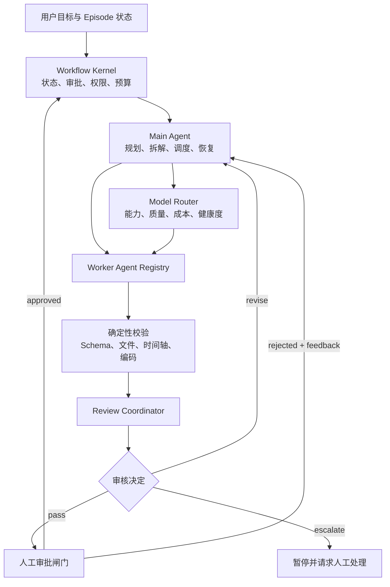

# AI Concept Studio Agent 架构 v2

状态：设计已确认，尚未实施

更新时间：2026-08-06

适用范围：`studio/` 本地视频生产系统

## 1. 决策摘要

Agent 架构 v2 采用“混合式主 Agent + 审核协调 Agent”模式：

- 代码状态机继续掌握审批、权限、预算、并发和数据写入等硬边界；
- Main Agent 负责理解目标、拆解任务、选择能力档位、调度 Worker 和处理失败；
- Model Router 根据能力、成本、供应商健康度和预算选择实际模型；
- Worker Agent 专注研究、脚本、分镜、素材、旁白、渲染等生产任务；
- Review Coordinator 使用分阶段规则审核每个关键产物；
- 人继续决定选题，并批准研究、脚本、分镜、素材与声音、最终成片五道闸门。

主 Agent 无权批准人工闸门、删除历史版本、绕过事实证据、自动发布或直接修改状态真源。审核 Agent 不能替代人工审批。

## 2. 为什么需要升级

v0.1 已经具备固定八步流水线、五道人工闸门、结构化模型输出、版本化产物、失败恢复和本地渲染，但仍有三个结构性缺口：

1. 调度主要由固定顺序驱动，不能根据任务质量、模型能力、成本和失败原因动态选择策略；
2. Worker 产物通常直接进入人工审批，缺少统一的机器审核层；
3. 模型路由主要是主供应商重试和备用供应商回退，尚未形成按任务能力、质量和预算选择模型的策略层。

v2 的目标不是追求完全自治，而是在保留现有可靠边界的前提下提高调度质量、产物质量和可解释性。

## 3. 目标与非目标

### 3.1 目标

- 一个 Main Agent 统一规划下一步、Worker、能力档位和审核方案；
- 每个关键 Worker 产物在进入人工审批前都有结构化审核报告；
- 模型选择由能力需求、质量等级、实时健康度、成本和预算共同决定；
- 所有计划、模型调用、审核、修改、失败和人工决定都可追踪；
- 自动修改存在明确上限，失败后能够安全暂停并请求人工处理；
- 现有黄金样例、五道人工闸门、版本历史和 Remotion 流程保持兼容。

### 3.2 非目标

- 不允许主 Agent 自由改变生产流程或审批规则；
- 不在本阶段自动发布内容；
- 不让审核模型代替事实来源或人工决定；
- 不让模型直接接触 API Key、Cookie 或未授权账号；
- 不一次性迁移到完全自治的多 Agent 框架；
- 不用生成式 UI 冒充真实产品截图、录屏或操作结果。

## 4. 总体架构



架构分为六层：

1. **Workflow Kernel**：不可由模型改变的控制内核；
2. **Main Agent**：受约束的智能调度者；
3. **Model Router**：实际模型与供应商选择器；
4. **Worker Agent**：专业生产执行者；
5. **Review Coordinator**：确定性检查与语义审核协调者；
6. **Human Gates**：不可绕过的最终决策层。

## 5. Workflow Kernel

现有 `src/server/orchestrator.mjs` 演进为 Workflow Kernel。它是唯一可以提交 Episode 状态变更的组件，并负责：

- 验证当前阶段是否允许运行；
- 验证 Main Agent 的计划是否符合固定流水线；
- 强制执行五道人工闸门；
- 限制单期并发、模型调用数、费用和自动修改轮数；
- 生成不可变的运行、审核和审批记录；
- 处理进程中断、产物缺失、模型暂停和恢复；
- 原子写入 `episode.json`；
- 拒绝越权工具调用、未知 Worker、未知模型档位和非法状态跳转。

任何模型输出都只是建议或候选补丁，必须通过 Kernel 验证后才能写入。

## 6. Main Agent

### 6.1 职责

Main Agent 负责：

- 理解本期目标、当前状态、审批意见和已知限制；
- 从 Kernel 提供的合法动作中选择下一步；
- 为任务选择 Worker 与能力档位，而不是任意模型名称；
- 为本次任务声明验收标准、预算和失败方案；
- 根据审核结果决定修改、换档、降级或请求人工处理；
- 向控制台提供可理解的调度理由。

Main Agent 不负责：

- 直接创作所有内容；
- 审核自己的输出；
- 批准人工闸门；
- 直接写文件或数据库；
- 自行扩大预算或自动修改安全策略。

### 6.2 输入

Main Agent 只能读取经过裁剪的 `MainAgentContext`：

- Episode 摘要与当前合法动作；
- 当前产物版本和内容哈希；
- 最近的人工反馈与审核报告；
- Provider 健康状态和可用能力档位；
- 本期剩余调用数和费用预算；
- 允许使用的 Worker 与工具；
- 固定的人工闸门和停止条件。

API Key、Cookie、完整环境变量和不必要的浏览历史不得进入上下文。

### 6.3 结构化输出

```json
{
  "action": "run_worker",
  "workerId": "storyboard-agent",
  "taskProfile": "creative-structured",
  "reason": "脚本已批准且当前没有有效分镜版本",
  "acceptanceCriteria": [
    "覆盖批准脚本中的所有核心论点",
    "证据场景具有来源标签和真实素材要求",
    "字幕时间轴连续"
  ],
  "reviewProfile": "storyboard-v1",
  "limits": {
    "maxAttempts": 2,
    "maxRevisionRounds": 2
  },
  "fallbackAction": "escalate_to_human"
}
```

Kernel 必须再次验证 `action`、`workerId`、`taskProfile`、预算和当前状态。

## 7. Model Router

Main Agent 只选择能力档位，Model Router 再选择具体供应商和模型，避免模型幻觉出不存在或无权限的模型名称。

### 7.1 初始能力档位

| Profile | 用途 | 核心要求 |
|---|---|---|
| `planner` | Main Agent 规划与恢复 | 推理稳定、严格结构化输出 |
| `fast-structured` | 分类、抽取、格式修复 | 低成本、低延迟、JSON Schema |
| `deep-research` | 长文档与证据分析 | 长上下文、引用与冲突识别 |
| `creative-structured` | 脚本、分镜、素材规划 | 中文表达、结构化创作 |
| `critical-review` | 事实与高风险产物审核 | 独立判断、证据核对 |
| `vision-review` | 分镜图、素材、成片视觉审核 | 图像或视频理解 |

### 7.2 路由输入

- 任务能力档位；
- Provider 是否配置、是否启用、近期错误和延迟；
- 模型是否支持严格结构化输出、视觉、上下文长度等能力；
- 本期剩余调用次数和费用；
- 当前阶段风险等级；
- 是否要求审核模型与生产模型隔离。

### 7.3 硬规则

- 明确的无额度、无权限、无效密钥或模型不可用错误不得在同一通道重复消耗；
- 可重试故障继续遵守主通道最多 3 次、备用通道最多 1 次的上限；
- 所有规划、生成和审核调用都计入统一预算；
- 每次 Provider 尝试前必须用 Episode CAS 持久化调用数与费用预留；请求结束后原子释放预留并结算实际用量，fallback 使用自身模型价格预留；
- 路由决策必须记录候选、选择原因、实际 Provider、模型、用量、延迟和错误；
- 用户在控制台手动锁定 Provider 或模型后，Main Agent 不得覆盖该选择；
- 高风险事实审核优先使用不同提示上下文，并在预算允许时使用不同模型或 Provider，降低相关性错误。

## 8. Worker Agent

现有八步流水线继续作为 Worker Registry：

| Worker | 主要产物 | 默认审核方式 |
|---|---|---|
| `trend-agent` | 热点候选与选择状态 | 规则校验，异常时语义复核 |
| `research-agent` | 一手资料、主张台账、证据包 | 来源规则 + 研究审核 |
| `script-agent` | 结构化脚本版本 | Schema + 脚本审核 |
| `storyboard-agent` | 场景、字幕、时间轴、素材提示 | 时间轴校验 + 分镜审核 |
| `asset-agent` | 逐项素材计划和登记结果 | 文件/版权/真实性校验 |
| `voice-agent` | 旁白方案和素材总审输入 | 文件/时长/授权/声画审核 |
| `render-agent` | 版本化 MP4 | 技术媒体校验 |
| `qa-agent` | 技术与内容质量报告 | 规则聚合 + 视觉审核 |

Worker 只返回候选产物及候选状态补丁。它不能直接把步骤推进到人工审批，必须先经过 Review Coordinator。

## 9. Review Coordinator

### 9.1 设计原则

- 使用一个协调器，不为每个阶段复制完整审核基础设施；
- 为研究、脚本、分镜、素材、声音和成片加载不同 Rubric；
- 先执行确定性检查，再调用模型审核，减少无效成本；
- 审核输入必须包含产物版本、证据、Rubric 版本和人工反馈；
- Reviewer 只能返回 `pass`、`revise` 或 `escalate`；
- Reviewer 无权批准人工闸门；
- 同一版本的审核报告不可覆盖，只能追加。

### 9.2 标准审核输出

```json
{
  "decision": "revise",
  "artifactVersion": 2,
  "rubricVersion": "storyboard-v1",
  "confidence": 0.91,
  "blockingIssues": [
    {
      "code": "UNMAPPED_CLAIM",
      "location": "scene-06",
      "evidence": "该结论没有绑定研究主张或来源",
      "suggestedFix": "绑定现有 claim，或删除该结论"
    }
  ],
  "warnings": [],
  "passedChecks": []
}
```

### 9.3 阶段审核矩阵

| 阶段 | 确定性检查 | 语义审核 | 通过后的人工闸门 |
|---|---|---|---|
| 采集/热点 | 格式、去重、时间范围、来源状态 | 异常信号和概念归类 | 人工选题 |
| 研究 | 来源类型、链接、哈希、主张覆盖 | 来源是否真正支持主张、冲突与边界 | 研究审批 |
| 脚本 | Schema、长度、必需章节 | 事实一致性、表达逻辑、受众价值 | 脚本审批 |
| 分镜 | 场景覆盖、时间轴、字幕连续性 | 视觉是否帮助理解、证据是否可展示 | 分镜审批 |
| 素材/旁白 | 文件、格式、哈希、时长 | 真实性、版权、授权、场景绑定 | 素材审批 |
| 成片 | 编码、尺寸、帧率、音轨、文件大小 | 视觉一致性、字幕可读性、声画与语义匹配 | 成片审批 |

### 9.4 自动修改策略

1. `pass`：Kernel 将步骤推进到 `waiting_approval`；
2. `revise`：Main Agent 把结构化问题交给原 Worker 生成新版本；
3. 同一阶段最多自动修改两轮；
4. 连续两轮存在同类阻断问题时直接 `escalate`；
5. 审核置信度低、证据冲突或成本不足时直接 `escalate`；
6. 人工驳回始终优先于机器审核意见。

## 10. Human Gates

五道人工闸门保持不变：

1. `research`：批准研究证据；
2. `script`：批准脚本；
3. `storyboard`：批准分镜；
4. `assets`：批准素材与声音；
5. `final`：批准最终成片。

审核 Agent 的作用是降低人工看到低质量草稿的概率，不是替人作决定。所有批准、驳回、意见、版本和时间必须继续写入完整历史。

## 11. 数据模型

在现有 Episode Schema 中新增以下领域，避免把调度与审核信息散落在 `production` 内：

```json
{
  "control": {
    "mode": "shadow",
    "planVersion": 1,
    "currentPlan": null,
    "activeOperation": null,
    "budget": {
      "maxCostUsd": null,
      "maxCalls": null,
      "usedCostUsd": 0,
      "usedCalls": 0,
      "reservedCostUsd": 0,
      "reservedCalls": 0,
      "reservations": []
    },
    "revisionLimit": 2
  },
  "reviews": {
    "script": {
      "status": "passed",
      "artifactVersion": 2,
      "artifactHash": "<sha256>",
      "rubricVersion": "script-v1",
      "reports": []
    }
  },
  "routingHistory": [],
  "planHistory": []
}
```

推荐将审核状态独立于现有流水线状态：

```text
not_started -> checking -> passed
                        -> revision_required
                        -> escalated
```

第一阶段不新增复杂的流水线状态。只有 `reviewStatus=passed`，Worker 产物才能进入 `waiting_approval`。

## 12. 运行时流程

一次正常运行遵循以下顺序：

1. Kernel 读取并验证 Episode；
2. Kernel 计算当前合法动作、预算和工具权限；
3. Main Agent 输出结构化计划；
4. Policy Engine 验证计划；
5. Model Router 选择实际 Provider 与模型；
6. Worker 生成新的版本化候选产物；
7. 确定性 Validator 检查结构和文件；
8. Review Coordinator 运行对应阶段 Rubric；
9. `pass` 进入人工审批，`revise` 生成新版本，`escalate` 暂停；
10. 人工批准或驳回；
11. Kernel 写入状态、事件、计划、路由和审核历史。

## 13. 可观测性与安全

每次运行至少记录：

- `runId`、`episodeId`、`parentRunId`；
- Main Agent 计划和计划版本；
- Worker、能力档位、实际 Provider 与模型；
- Prompt/Rubric 版本和输入产物哈希；
- 调用次数、Token、预计成本、延迟和失败分类；
- Validator 与 Reviewer 结果；
- 修改轮数、人工决定和停止原因。

不得记录：

- API Key 或其片段；
- Cookie、登录令牌和密码；
- 无关的本机环境变量；
- 未经授权的个人文件内容；
- 模型隐藏推理过程。

## 14. 控制台改造

控制台增加以下信息，但不暴露密钥：

- Main Agent 当前计划、调度理由和下一动作；
- 当前 Worker、能力档位、实际 Provider/模型；
- 本期模型调用数、费用和预算剩余；
- 审核状态、阻断问题、警告和修改轮数；
- 人工可执行的继续、停止、换档、批准和驳回操作；
- `shadow / assisted / active` 三种 Main Agent 模式；
- Provider 或模型的人工锁定状态。

模式含义：

- `shadow`：Main Agent 只提出计划，仍由现有固定流程执行；
- `assisted`：Main Agent 可以调度，但关键动作逐次由人确认；
- `active`：在预算和闸门内自动运行，遇到审批或升级条件时暂停。

初次上线必须使用 `shadow`。

## 15. 文件级改造清单

### 15.1 新增文件

| 优先级 | 文件 | 任务 |
|---|---|---|
| P0 | `studio/src/shared/agent-contracts.mjs` | 定义 Main Plan、Worker Result、Review Result 和 Routing Decision 的 Schema 与校验器 |
| P0 | `studio/src/server/control/policy-engine.mjs` | 计算合法动作并验证计划、预算、工具权限和人工闸门 |
| P0 | `studio/src/server/reviews/coordinator.mjs` | 统一执行 Validator、Rubric、结果归档和修改/升级判断 |
| P0 | `studio/src/server/reviews/contracts.mjs` | 审核状态、问题、证据定位和报告版本的数据合同 |
| P0 | `studio/src/server/reviews/validators/episode.mjs` | 通用 Episode、版本和来源引用检查 |
| P0 | `studio/src/server/reviews/validators/timeline.mjs` | 场景与字幕时间轴检查 |
| P0 | `studio/src/server/reviews/validators/assets.mjs` | 素材文件、哈希、类型、授权和场景绑定检查 |
| P0 | `studio/src/server/reviews/validators/media.mjs` | 视频编码、尺寸、帧率、音轨和文件检查 |
| P1 | `studio/src/server/reviews/rubrics/research.mjs` | 研究来源、主张支持、冲突和边界审核定义 |
| P1 | `studio/src/server/reviews/rubrics/script.mjs` | 脚本事实、结构、受众价值和表达审核定义 |
| P1 | `studio/src/server/reviews/rubrics/storyboard.mjs` | 分镜覆盖、语义、字幕和视觉表达审核定义 |
| P1 | `studio/src/server/reviews/rubrics/assets.mjs` | 素材真实性、版权、授权和完整性审核定义 |
| P1 | `studio/src/server/reviews/rubrics/final.mjs` | 最终视觉、声画、字幕和跨阶段一致性审核定义 |
| P1 | `studio/config/review-rubrics.json` | Rubric 版本、必过项、升级条件和自动修改上限 |
| P2 | `studio/src/server/control/model-router.mjs` | 按能力、健康度、费用和人工锁定选择 Provider/模型 |
| P2 | `studio/config/model-registry.json` | 模型能力、结构化输出、视觉、上下文、成本等级与启用状态 |
| P2 | `studio/config/routing-policy.json` | Profile、回退、隔离、预算和风险策略 |
| P3 | `studio/src/server/control/main-agent.mjs` | 生成结构化计划、解释调度原因并处理审核反馈 |
| P3 | `studio/src/server/control/context-builder.mjs` | 为 Main Agent 构造最小、安全、可追踪的上下文 |
| P3 | `studio/src/server/control/plan-store.mjs` | 保存计划版本、路由历史和恢复信息 |
| P4 | `studio/src/server/reviews/visual-review.mjs` | 基于截图、关键帧或 filmstrip 的视觉审核适配器 |

### 15.2 修改现有文件

| 优先级 | 文件 | 改造内容 |
|---|---|---|
| P0 | `studio/src/shared/schema.mjs` | 增加 `control`、`reviews`、`routingHistory`、`planHistory` 和审核状态校验 |
| P0 | `studio/src/shared/workflow.mjs` | 审核未通过时禁止进入人工审批；驳回继续保留旧版本并失效下游审核 |
| P0 | `studio/src/server/orchestrator.mjs` | 演进为 Kernel；在 Worker 与人工审批之间插入 Review Coordinator |
| P0 | `studio/src/server/agents/registry.mjs` | Worker 只返回候选产物，不直接绕过审核进入 `waiting_approval` |
| P0 | `studio/src/shared/store.mjs` | 保存计划、审核和路由历史，继续使用原子写入 |
| P1 | `studio/src/server/production/quality.mjs` | 把现有规则拆为可组合 Validator，并保持旧调用兼容 |
| P1 | `studio/src/server/qa.mjs` | 聚合技术 QA、内容 Validator 和视觉审核结果 |
| P1 | `studio/src/server/research/agent.mjs` | 输出主张到来源的稳定标识，供研究审核引用 |
| P1 | `studio/src/server/production/generator.mjs` | 接受能力档位、审核反馈和 Prompt 版本；保存生成输入哈希 |
| P2 | `studio/src/server/ai/client.mjs` | 保留 Responses API 调用和失败分类，把模型选择委托给 Model Router |
| P2 | `studio/src/shared/ai-config.mjs` | 合并本机锁定、模型注册表和路由策略，继续隐藏密钥 |
| P2 | `studio/config/ai.json` | 保留 Provider 连接信息；任务到模型的固定映射迁移为 Profile 默认值 |
| P3 | `studio/src/server/app.mjs` | 增加计划、审核、预算、模式切换和人工模型锁定 API |
| P3 | `studio/src/web/app.js` | 展示计划、审核报告、阻断问题、预算和调度解释 |
| P3 | `studio/src/web/index.html` | 增加 Main Agent 与审核控制台区域 |
| P3 | `studio/src/web/styles.css` | 为新增控制区补充现有浅色视觉系统样式 |
| P4 | `studio/src/server/renderer.mjs` | 渲染后生成关键帧/filmstrip 供视觉审核，保持 MP4 版本化 |

### 15.3 新增或扩展测试

| 优先级 | 文件 | 覆盖内容 |
|---|---|---|
| P0 | `studio/tests/agent-contracts.test.mjs` | 非法计划、未知动作、越权工具和错误审核结果被拒绝 |
| P0 | `studio/tests/review-coordinator.test.mjs` | pass/revise/escalate、Rubric 版本和报告追加 |
| P0 | `studio/tests/policy-engine.test.mjs` | 人工闸门、预算、并发、修改轮数和状态跳转 |
| P0 | `studio/tests/workflow.test.mjs` | 审核失败不得进入审批，旧版本和下游失效保持正确 |
| P0 | `studio/tests/orchestrator-recovery.test.mjs` | 审核中断、计划中断和 Worker 中断均能恢复 |
| P1 | `studio/tests/review-rubrics.test.mjs` | 每阶段必过项、阻断项和证据定位 |
| P2 | `studio/tests/model-router.test.mjs` | 能力匹配、健康度、预算、人工锁定和回退 |
| P2 | `studio/tests/ai-config.test.mjs` | Profile 配置、Provider 隐私和本机覆盖 |
| P3 | `studio/tests/main-agent.test.mjs` | 结构化计划、合法动作选择、反馈修订和停止条件 |
| P3 | `studio/tests/server.test.mjs` | 新 API、权限边界和密钥不泄露 |
| P4 | `studio/tests/visual-review.test.mjs` | 关键帧生成、视觉审核输入和失败升级 |

## 16. 迁移阶段

### Phase A：合同与审核底座

- 增加结构化合同、Policy Engine 和 Review Coordinator；
- 把现有确定性质量检查接入审核层；
- Worker 输出必须通过审核后才能进入人工审批；
- Main Agent 尚不参与真实调度。

### Phase B：模型路由

- 增加模型注册表、能力档位、预算和健康状态；
- 将当前固定任务模型迁移为 Profile；
- 保留现有 AiHubMix/OpenAI 重试与回退策略；
- 控制台显示模型选择原因和实际调用结果。

### Phase C：Main Agent 影子模式

- Main Agent 为每次运行生成计划，但不执行；
- 与现有固定调度结果对比；
- 记录越权计划、错误下一步和预算预测误差；
- 通过黄金样例评测后才进入下一阶段。

### Phase D：受控调度

- Main Agent 可以调度 Worker、Profile 和修改循环；
- Kernel 继续验证每一个动作；
- 初期使用 `assisted` 模式，关键动作逐次确认；
- 达到验收门槛后才允许 `active` 模式。

### Phase E：视觉审核与评测闭环

- 为分镜、素材和成片生成关键帧或 filmstrip；
- 接入 `vision-review`；
- 建立黄金样例、拒绝样例和边界样例评测集；
- 根据人工驳回原因持续调整 Rubric 与路由策略。

## 17. 验收标准

v2 只有同时满足以下条件才可以进入 `active`：

1. 每个关键 Worker 产物都有与版本绑定的审核报告；
2. 审核失败的产物无法进入人工审批；
3. Main Agent 无法绕过五道人工闸门；
4. Main Agent 只能从 Kernel 提供的合法动作中选择；
5. 自动修改最多两轮，不会无限调用模型；
6. 模型选择、费用、失败和回退过程可追踪；
7. 用户的 Provider/模型锁定不会被自动覆盖；
8. 进程重启后计划、审核和修改状态能够恢复；
9. 旧版本、人工意见和审计历史不会被覆盖；
10. 黄金样例完整回归，现有固定流程仍可作为降级路径；
11. API、日志、审核报告和前端不返回密钥；
12. 最终成片仍需技术 QA、内容/视觉审核和人工终审全部通过。

## 18. 发布与回滚

- 使用功能开关分别控制 Review、Model Router 和 Main Agent；
- 默认保持 `shadow` 模式；
- 每个阶段都必须能够回退到当前固定调度；
- 数据迁移只能新增字段，不破坏旧 Episode 读取；
- 新字段缺失时使用安全默认值；
- 禁止自动批量迁移或覆盖历史产物；
- 任一关键回归失败时关闭新功能开关，而不是删除新历史数据。

## 19. 外部设计参考

- [OpenAI Agents SDK：Agent Orchestration](https://openai.github.io/openai-agents-js/guides/multi-agent/)
- [OpenAI Agents SDK：Guardrails](https://openai.github.io/openai-agents-js/guides/guardrails/)
- [OpenAI：Structured Outputs](https://openai.com/index/introducing-structured-outputs-in-the-api/)

这些参考用于架构模式和合同设计；v2 不要求第一阶段立即迁移到 Agents SDK，可以先在现有 Node.js 编排器上实现相同边界。
