# 视频动效组件库

本库从 [Amicro](https://github.com/Subhan-code/Amicro--Micro-transitions-) 中筛选并改写了 35 个适合横版 AI 概念视频的动效。上游源码固定在提交 `07adc1640084940f045875e2bb1b682c90f30c3c`，授权为 MIT。

这里的 GIF 是人工选型入口；真正用于成片的是同一套 Remotion 帧驱动组件。GIF 的第一帧和最后一帧可无缝衔接，组件不依赖鼠标悬停、CSS transition、CSS animation 或随机数。

## 使用

本地逐帧预览全部组件：

```bash
cd studio
pnpm motion:gallery
```

在 Remotion 场景中调用：

```jsx
import {MotionLibraryEffect} from './motion-library/library.jsx';

<MotionLibraryEffect
  effectId="circuit-trace-draw"
  startFrame={90}
  durationInFrames={72}
/>
```

默认规则：仅横版；薄荷约 80%、紫色约 20%；平面组件优先；同层级表面一致；字幕不得调用本库文字动效；非小型独立模块不得再套大卡片。

## 人工预览目录

### 1. 基础入场与正文文字

#### 平稳淡入 · `fade-in`

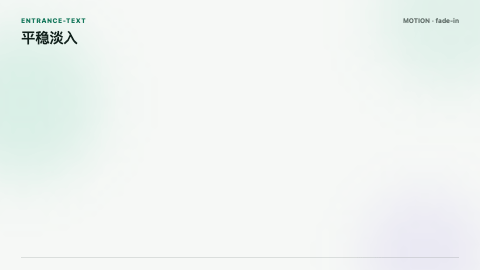

内容保持原位，以低干扰透明度变化进入。

适合：`场景内补充说明`、`证据元素出现`、`低优先级内容进入`

避免：`字幕`、`需要表达方向关系时`

#### 轻微上移淡入 · `fade-up`

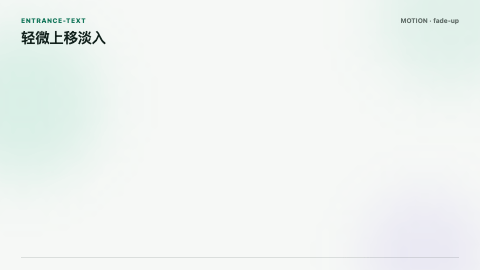

从下方少量位移进入，适合标题或关键结论。

适合：`页面标题`、`关键结论`、`小型模块`

避免：`字幕`、`连续密集列表`

#### 轻微下移淡入 · `fade-down`

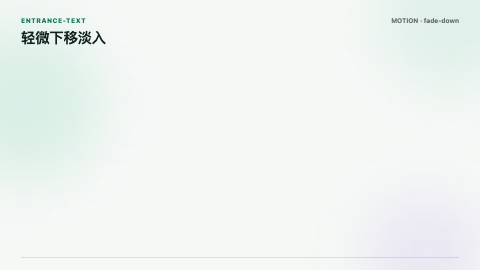

从上方少量位移进入，适合标签与次级提示。

适合：`章节标签`、`状态说明`、`上方注释`

避免：`字幕`、`大面积内容`

#### 左向接管 · `slide-left`

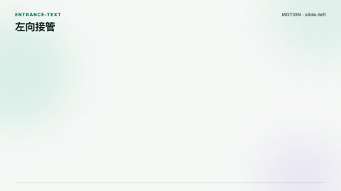

内容从右侧进入并向左完成接管，表达前进关系。

适合：`流程推进`、`前后步骤切换`、`局部页面接管`

避免：`字幕`、`无方向语义的装饰`

#### 右向返回 · `slide-right`

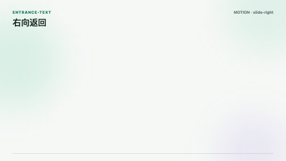

内容从左侧进入，适合表达返回、回溯或结果回流。

适合：`结果回流`、`回到上一层`、`反向关系`

避免：`字幕`、`无方向语义的装饰`

#### 克制缩放进入 · `scale-in`


从 97% 左右恢复到完整尺寸，不使用明显弹跳。

适合：`重点对象聚焦`、`小型独立模块`、`确认结果`

避免：`同级卡片差异化`、`字幕`

#### 文字遮罩揭示 · `text-reveal`


通过平稳遮罩展开正文或标题，不闪烁、不逐字跳动。

适合：`标题`、`正文关键句`、`章节判断`

避免：`字幕`、`长段落`

#### 中文分词依次揭示 · `word-reveal`


按中文词组依次进入，用于短句层级而非逐字炫技。

适合：`短标题`、`三到五个关键词`、`因果短句`

避免：`字幕`、`长段落`、`需要同时阅读的证据原文`

### 2. 构图、关系与流程

#### 同级卡片线性展开 · `card-linear-spread`

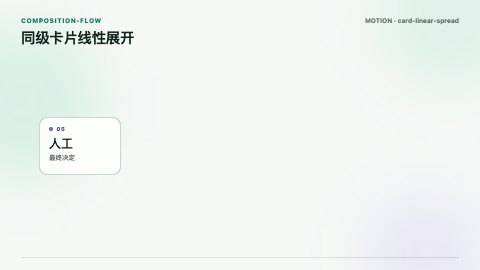

同级平面模块从重叠状态等距铺开，保持相同尺寸与表面。

适合：`并列概念`、`同级选项`、`阶段总览`

避免：`单一大内容`、`把完整页面包进大卡片`

#### 卡片级联入场 · `card-cascade-stagger`

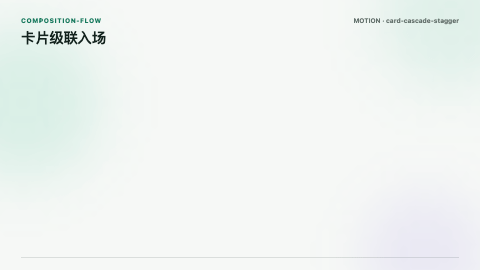

同级模块按阅读顺序依次进入，最终严格对齐。

适合：`步骤列表`、`三到五项支持点`、`分层说明`

避免：`字幕`、`需要同时比较的关键数据`

#### 卡片弧形编排 · `card-arc`

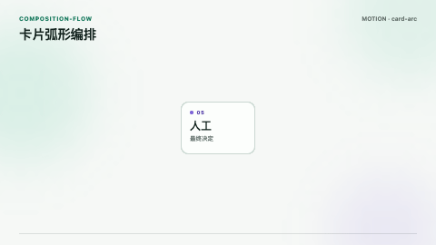

少量卡片形成克制弧线，仅用于概念集合的短暂总览。

适合：`概念集合`、`备选路径`、`素材组`

避免：`严谨流程`、`需要逐字阅读的卡片`、`默认同级卡片布局`

#### 调用线路绘制 · `circuit-trace-draw`

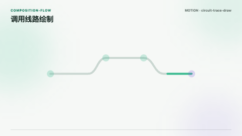

线段从源节点向目标节点生长，用于解释调用路径。

适合：`Agent 调用`、`数据流`、`受控执行路径`

避免：`无真实关系的装饰线`、`密集时序图`

#### 能力网络展开 · `hexagon-lattice-draw`


轻量六边形网络按中心向外展开，表达模块化能力关系。

适合：`能力地图`、`模块组合`、`协议网络`

避免：`真实流程顺序`、`超过十二个节点`

#### 模块吸附成组 · `modular-tile-snap`

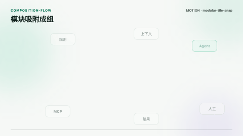

独立模块吸附成规则网格，表达能力被组织为系统。

适合：`能力归类`、`组件组合`、`从散点到结构`

避免：`单一大内容`、`模块并非同级时`

#### 分段连接伸展 · `segmented-link-stretch`

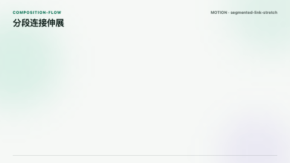

短连接段依次伸展并对接，表达标准接口建立。

适合：`协议连接`、`工具接入`、`链路组装`

避免：`复杂多分支网络`、`无接口语义时`

#### 因果链推进 · `domino-chain`

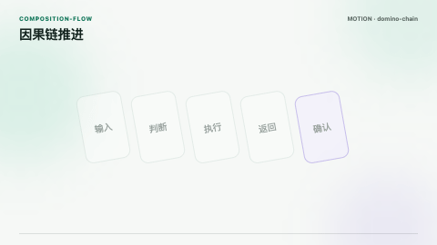

节点按顺序产生轻微倾转与传递，用于短因果链。

适合：`因果关系`、`连续触发`、`依赖传播`

避免：`关键数据展示`、`长流程`、`厚重 3D`

### 3. 界面状态与反馈

#### 筛选标签确认 · `filter-tag-pill`

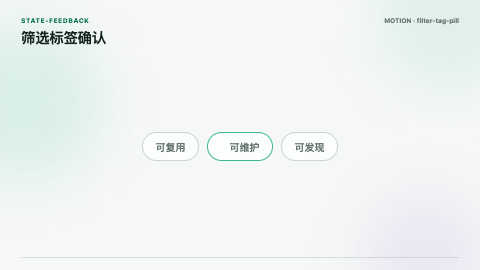

标签从待选状态进入已选择状态，适合表达条件生效。

适合：`条件筛选`、`约束启用`、`标签选择`

避免：`字幕`、`大标题`

#### 动作胶囊展开 · `morph-action-pill`

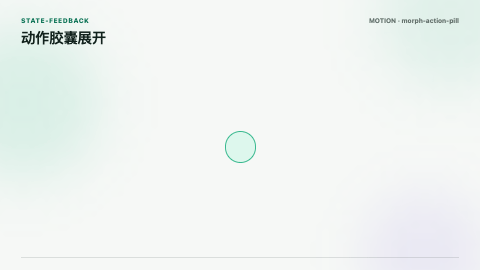

小图标扩展为带文字的动作提示，用于一次性确认。

适合：`动作确认`、`结果提示`、`小型独立模块`

避免：`连续浮动`、`大面积容器`

#### 分段步骤条 · `segmented-step-bar`

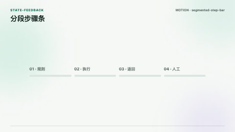

按步骤点亮同色分段，表达当前执行位置。

适合：`短流程进度`、`阶段状态`、`执行链`

避免：`替代全片章节进度`、`显示秒数`

#### 步骤节点推进 · `segmented-stepper-dots`

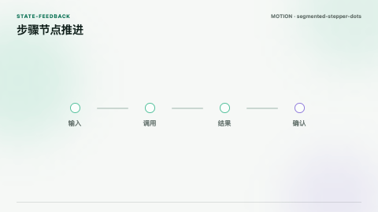

节点与连接线同步推进，适合小型执行状态模块。

适合：`Agent 阶段`、`审核步骤`、`状态切换`

避免：`全片底部章节进度`、`大面积流程图`

#### 小模块预览展开 · `card-glance-preview`

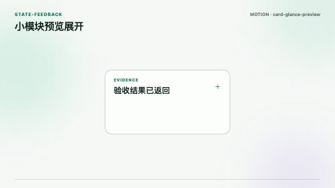

小型条目在原位展开补充信息，不创建大卡片套页面。

适合：`证据摘要`、`术语解释`、`局部详情`

避免：`完整页面`、`大内容窗口`、`同级卡片表面混用`

#### 保存状态确认 · `bookmark-save-pill`

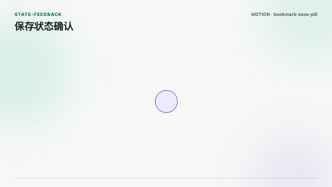

书签图标平稳转为已保存状态，表达结果持久化。

适合：`结果保存`、`版本固化`、`资产入库`

避免：`无保存语义的装饰`

#### 检查项完成 · `checkbox-draw`

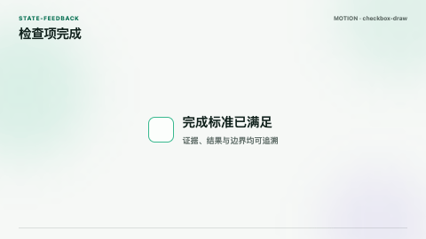

边框稳定出现后绘制勾选路径，用于验收完成。

适合：`检查项`、`验证通过`、`完成标准`

避免：`尚未确认的结果`、`连续装饰`

#### 提交结果变形 · `form-submit-morph`

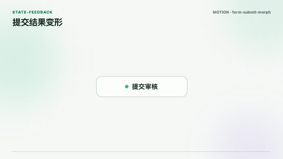

提交动作从进行中平稳变为完成状态。

适合：`人工批准`、`提交完成`、`结果返回`

避免：`自动通过的误导`、`没有真实结果时`

### 4. AI 处理状态

#### 处理点位流转 · `smooth-dot-shift`

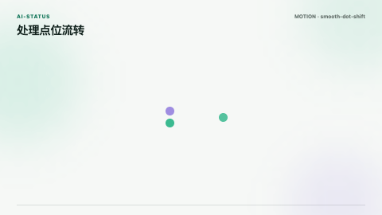

三个点位平滑换位，表示任务正在不同处理单元间流转。

适合：`短暂处理中`、`节点调度`、`等待返回`

避免：`长时间持续播放`、`字幕附近`

#### 能力聚合 · `magnetic-dots`

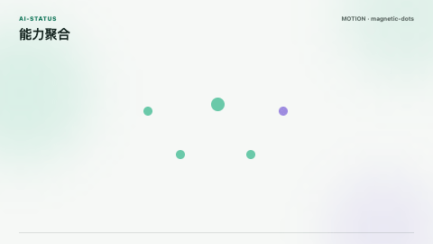

点位先分散后聚合，表达上下文或能力汇入当前任务。

适合：`上下文聚合`、`多源输入`、`能力汇入`

避免：`真实物理关系`、`长时间循环`

#### 环形处理进度 · `arc-tracer`

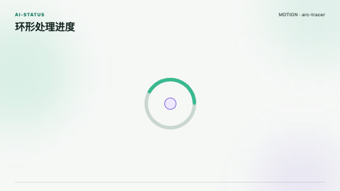

单一弧线沿圆周推进，适合小型处理状态。

适合：`处理中`、`单任务等待`、`后台执行`

避免：`播放器进度`、`章节进度`、`显示具体百分比时`

#### 处理强度柱 · `morphing-bars`

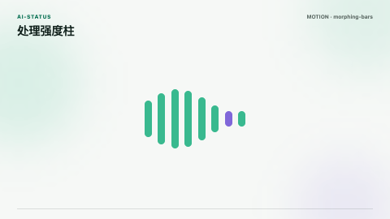

同色柱体平稳改变高度，表达计算活跃而非真实数据。

适合：`模型处理中`、`语音或流式响应`、`活跃状态`

避免：`需要精确数据`、`字幕闪烁式装饰`

#### 波形处理状态 · `waveform-loader`

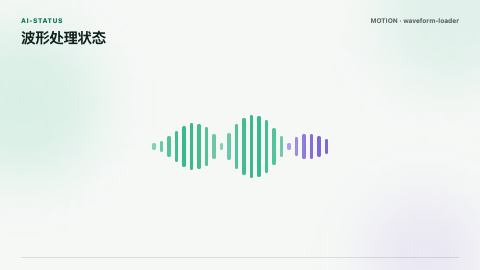

低幅波形表示音频、流或模型处理活动。

适合：`语音处理`、`流式响应`、`实时分析`

避免：`没有音频或流语义时`、`字幕背景`

#### 网格状态变换 · `shape-shift-grid`

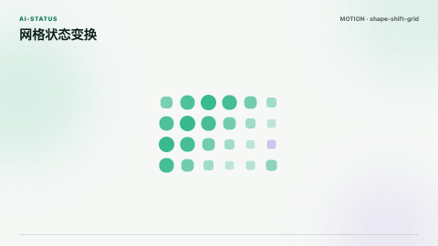

规则网格的局部形态平稳变化，表达内部状态重组。

适合：`模型内部处理`、`模块重排`、`状态重组`

避免：`需要解释具体节点关系时`、`高频闪烁`

### 5. 数据与证据

#### 证据折线生长 · `mono-rounded-line`

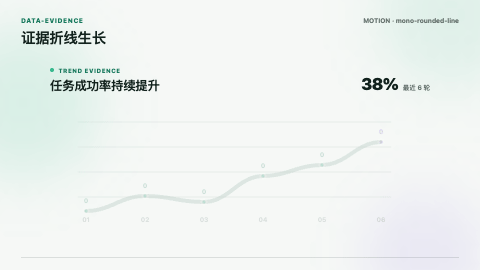

折线按时间方向绘制，只保留图表主体与必要标注。

适合：`趋势证据`、`前后变化`、`时间序列`

避免：`无数据来源`、`把图表包进第二层大卡片`

#### 证据柱状比较 · `mono-rounded-bar`

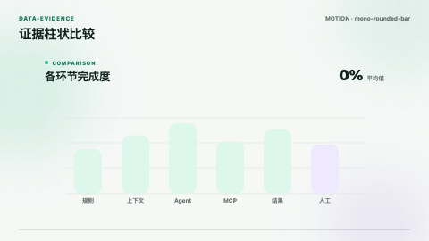

圆角柱体从基线增长，用于少量分类对比。

适合：`分类比较`、`前后差异`、`结果证据`

避免：`超过七个分类`、`无数据来源`、`仪表盘拼贴`

#### 流向证据图 · `mono-rounded-sankey`

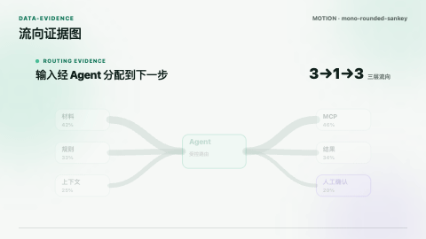

三层以内的流向带按源到目标展开，用于解释分配关系。

适合：`流量分配`、`能力路由`、`成本或任务去向`

避免：`密集多节点`、`无精确流向数据`、`默认架构图`

### 6. 场景转场

#### 分屏揭示 · `split-gate-reveal`

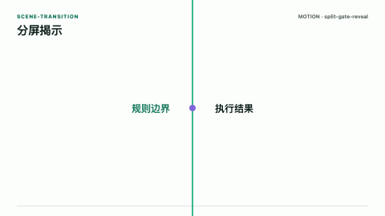

两侧平面短暂分开揭示新内容，只在语义环境切换时使用。

适合：`章节级语义切换`、`前后对照揭示`

避免：`句子级切换`、`连续十五秒内重复使用`

#### 径向聚焦揭示 · `radial-iris-mask`

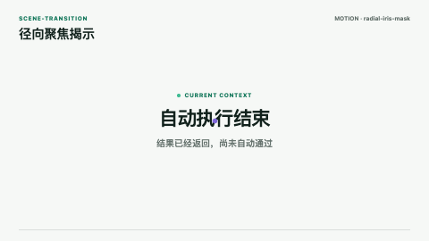

从焦点位置扩张的圆形遮罩揭示新内容，低频使用。

适合：`聚焦一个关键对象`、`章节级揭示`

避免：`字幕切换`、`连续页面切换`、`无明确焦点时`

## 来源与维护

- 上游原始文件保存在 `studio/src/video/motion-library/upstream/amicro/`，并带有选择清单、哈希和授权说明。
- `pnpm motion:archive` 按固定提交重新核验并归档上游文件。
- `pnpm motion:previews` 重新渲染全部 GIF。
- `pnpm motion:check` 检查目录、归档、GIF 尺寸、大小与完整性。
- 新增动效前先写清使用场景和禁用场景，再进入组件注册表，避免 Agent 只凭名字误选。
