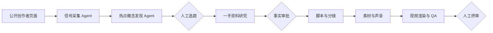

# AI Concept Studio

面向 AI 产品经理的长视频 Agent 制作系统。目标是把近期正在形成共识的 AI 技术概念，转化为有证据、可审批、能持续维护的 8～12 分钟竖屏视频。

当前版本不是自动发布工具。它会完成发现、整理、生成、渲染和检查，但选题、关键事实、脚本、声音、成片与发布都保留人工确认。

## 当前进度

- 热点概念发现 Agent v0.1 已可运行：读取创作者信号、归一化概念、去除事件噪声、按独立创作者共振打分，并把候选送入人工选择。
- 创作者信号采集 Agent v0.1 已可运行：B站公开页程序直读，抖音等客户端渲染页面生成 Codex 辅助任务，统一去重后再刷新热点雷达。
- Research Agent v0.1 已可运行：人工选题会创建一期草稿，系统检查一手资料可达性、建立 8 类事实问题、生成 Codex 辅助任务，并在证据达到硬门槛前阻止事实审批。
- 已配置 18 个观察源，首份公开信号快照包含 51 条内容信号；缺失播放量和评论数据时不会猜测。
- Agentic Coding 黄金样例已贯通结构化数据、真实产品画面、Remotion 竖屏 MP4 和自动 QA。
- 脚本、分镜和素材 Agent 已有统一接口、状态机与审批约束，下一阶段会按 Research Agent 的证据包升级为真实生成能力。
- 周期调度尚未接入；当前可以在控制台手动运行采集，也可以由后续 Codex 自动任务触发。



## 打开系统

双击 `启动AI视频系统.cmd`。本地控制台会打开：

`http://127.0.0.1:4317`

在“热点概念雷达”里可以重新运行发现 Agent，并把通过门槛的概念选为研究候选。关闭启动窗口即可停止服务，项目数据与视频不会丢失。

## 常用操作

在本目录中运行：

```text
pnpm import:trends   导入默认公开信号快照
pnpm collect         检查公开来源并刷新可直读信号
pnpm import:collector -- <文件名>  导入 Codex 辅助采集批次
pnpm trends          重新计算热点候选
pnpm research        为已选概念建立一手资料与事实证据任务
pnpm import:research -- <文件名>  导入 Codex 辅助研究证据批次
pnpm test            运行回归测试
pnpm check           检查主要模块语法
pnpm render:preview  重新生成黄金样例视频
pnpm qa              检查黄金样例视频
```

## 关键文件

- `TREND-AGENT.md`：热点发现 Agent 的数据、门槛、评分和更新方法。
- `COLLECTOR-AGENT.md`：公开来源采集、Codex 辅助和失败恢复方法。
- `RESEARCH-AGENT.md`：一手资料、主张台账、证据门槛和事实审批方法。
- `SYSTEM-CONTRACT.md`：系统边界、人工闸门和完成标准。
- `config/trend-sources.json`：创作者观察源及权重。
- `config/concept-taxonomy.json`：概念、别名、产品决策与一手资料计划。
- `config/trend-radar.json`：时间窗口、硬门槛和评分权重。
- `config/collector.json`：采集超时、并发、有效窗口与适配器配置。
- `data/collector/assist-task.json`：普通程序无法读取时交给 Codex 的采集任务。
- `data/trends/signals.json`：已经导入的标准化市场信号。
- `data/trends/latest.json`：最近一次热点发现结果。
- `data/trends/selection.json`：人工选择后交给研究 Agent 的任务。
- `data/research/`：研究计划、运行快照、辅助任务和证据批次。
- `data/episodes/<期数>/episode.json`：每期视频唯一状态源。
- `src/server/agents/registry.mjs`：一期制作 Agent 的统一入口。
- `src/video/`：可维护的视频模板。

## 维护原则

1. 竞品内容只证明“市场在讨论”，不能证明技术事实；事实必须回到官方文档、论文或原始项目。
2. 同一创作者的多个账号或同一系列内容只计一个独立覆盖组。
3. 产品发布、融资和大会内容先提炼成可跨产品解释的概念，事件本身不直接立项。
4. 缺失数据保持缺失，界面显示已知维度和置信度，不填造播放量、互动率或评论问题密度。
5. 选题必须经过人工确认；系统不自动发布，也不把 Cookie、账号或密钥写入项目。
6. 每新增一个模块，先用固定样例和回归测试验证可复现，再接入生产流程。
